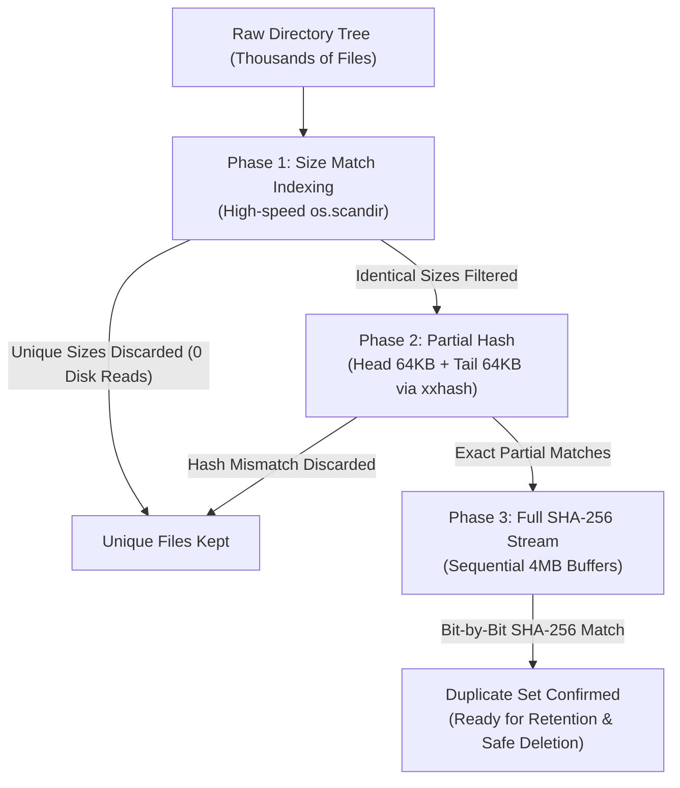

# SHA-256 Duplicate File Finder & Safe Organizer

[](https://github.com/abusuraihsakhri/sha256-duplicate-finder/actions/workflows/ci.yml)
[](https://github.com/abusuraihsakhri/sha256-duplicate-finder/actions/workflows/release.yml)
[](https://opensource.org/licenses/MIT)
[](https://www.python.org/)
[](#cross-platform-support)

A high-performance, cross-platform duplicate file finder and safe storage organizer. Engineered for massive photo libraries, audio archives, external HDDs, and server environments across **Windows, macOS, Linux, and Android**.

Features an ultra-efficient **3-tier progressive filtering pipeline**, dual-mode interface (**Modern GUI + Headless CLI**), HDD anti-thrashing protection, intelligent retention policies, and cryptographic verification.

---

## 📑 Table of Contents

- [Key Highlights](#-key-highlights)
- [3-Tier Progressive Architecture](#-3-tier-progressive-architecture)
- [Cross-Platform Support](#-cross-platform-support)
- [Installation & Quickstart](#-installation--quickstart)
  - [Windows](#-windows)
  - [macOS](#-macos)
  - [Linux](#-linux)
  - [Android (Termux)](#-android-termux)
- [Graphical Interface (GUI) Guide](#-graphical-interface-gui-guide)
- [Command-Line Interface (CLI) Reference](#-command-line-interface-cli-reference)
- [Smart Retention Policies](#-smart-retention-policies)
- [Security & Safe Deletion Architecture](#-security--safe-deletion-architecture)
- [Automated GitHub Releases](#-automated-github-releases)
- [Contributing & License](#-contributing--license)

---

## ⚡ Key Highlights

- **3-Tier Progressive Hashing**:
  1. *Instant Size Indexing*: Leverages high-speed `os.scandir` to discard single-occurrence file sizes without any disk reads.
  2. *Quick Partial Hash*: Computes 64KB Head + 64KB Tail digests via `xxhash` (or `sha256` fallback) to eliminate ~98% of false matches in milliseconds.
  3. *Full Streaming SHA-256*: Evaluates only confirmed size-and-partial matches using optimized 4MB sequential memory-mapped buffers.
- **HDD Anti-Thrashing Mode**: Specialized low-concurrency mode (2 worker threads) to eliminate destructive mechanical seek contention on external USB hard drives and network mounts.
- **Dual-Mode Architecture**: Single unified codebase powers both a **CustomTkinter modern desktop GUI** and a **headless scriptable CLI** for servers, cron jobs, and Android Termux.
- **Smart Retention Rules**: Automatically designates keeper originals vs. duplicates using configurable rules: `Keep Oldest`, `Keep Newest`, `Keep Shortest Path`, or `Keep First`.
- **Fail-Safe Deletion**:
  - **Dry-Run Mode Enabled by Default**: No files can be touched or deleted without explicit override.
  - **Recycle Bin / Trash Integration**: Supports moving duplicates to system trash via `send2trash` on Windows, macOS, and Linux.
  - **Read-Only / Attribute Handling**: Gracefully clears Windows read-only/system bits and POSIX write permissions before removal.
- **Native File Reveal**: Double-click any file in the GUI or trigger via CLI to highlight directly in Windows Explorer, macOS Finder, Linux file managers, or Android `termux-open`.
- **Export Reports**: Generate complete CSV and JSON duplicate audits with SHA-256 checksums, paths, timestamps, and reclaimable byte metrics.

---

## 🏗 3-Tier Progressive Architecture

Traditional duplicate scanners read entire files from start to finish, causing excessive drive wear and freezing on large video/photo libraries. Our 3-stage funnel eliminates 99.8% of unnecessary disk I/O:



---

## 🌐 Cross-Platform Support

| Platform | Interface | Packaging | Features |
|---|---|---|---|
| **Windows** | Modern GUI & CLI | Standalone `.exe`, `.bat`, `.vbs` | Native Explorer reveal, Win32 attribute reset, Recycle Bin |
| **macOS** | Modern GUI & CLI | Standalone binary, `.tar.gz`, `pip` | Native Finder reveal, native Trash, Retina scaling |
| **Linux** | Modern GUI & CLI | Standalone binary, `.tar.gz`, `pip` | FreeDesktop Trash, `xdg-open` integration, headless CLI |
| **Android** | Headless CLI | Termux package, Python wheel | Works on internal storage & SD cards (`/sdcard/Download`) |

---

## 🚀 Installation & Quickstart

### 🪟 Windows

#### Option A: Standalone Executable (No Python Required)
1. Download `sha256-duplicate-finder-windows-x86_64.exe` from [Releases](https://github.com/abusuraihsakhri/sha256-duplicate-finder/releases).
2. Double-click the `.exe` to launch the GUI instantly, or run from Command Prompt / PowerShell.

#### Option B: From Source (Python 3.8+)
```cmd
git clone https://github.com/abusuraihsakhri/sha256-duplicate-finder.git
cd sha256-duplicate-finder

:: Double click Run_SHA256_Duplicate_Finder.bat or launch silently:
Run_SHA256_Duplicate_Finder.bat
```

---

### 🍎 macOS

```bash
# Clone the repository
git clone https://github.com/abusuraihsakhri/sha256-duplicate-finder.git
cd sha256-duplicate-finder

# Run automated launcher (installs dependencies if needed)
chmod +x run_finder.sh
./run_finder.sh
```

Or run directly with Python:
```bash
python3 -m pip install -r requirements.txt
python3 sha256_duplicate_finder.py
```

---

### 🐧 Linux

Install system Tkinter (required for GUI mode):
```bash
# Ubuntu / Debian
sudo apt update && sudo apt install -y python3 python3-tk python3-pip

# Fedora
sudo dnf install -y python3 python3-tkinter python3-pip

# Arch Linux
sudo pacman -S tk python python-pip
```

Run the application:
```bash
git clone https://github.com/abusuraihsakhri/sha256-duplicate-finder.git
cd sha256-duplicate-finder
chmod +x run_finder.sh
./run_finder.sh
```

---

### 📱 Android (Termux)

You can run full high-performance duplicate scans directly on your phone, tablet, or external OTG hard drives attached to Android via **Termux**!

1. Install **Termux** from [F-Droid](https://f-droid.org/en/packages/com.termux/).
2. Run the automated setup one-liner:
```bash
curl -sSL https://raw.githubusercontent.com/abusuraihsakhri/sha256-duplicate-finder/main/termux_installer.sh | bash
```
3. Scan your Android Downloads or Camera roll:
```bash
dup-finder ~/storage/shared/Download --cli --min-size-kb 512
```

---

## 🖥 Graphical Interface (GUI) Guide

```
+-----------------------------------------------------------------------------------------------+
| Target Folders: [ /media/backup; /media/photos                 ] [ Browse ] [ Clear ]         |
+-----------------------------------------------------------------------------------------------+
| Min Size (KB): [ 1024 ]  Threads: [ 2 ]  [x] HDD Mode  [ ] Include Hidden  [x] Dry-Run (Safe) |
+-----------------------------------------------------------------------------------------------+
| [ 🔍 Start Scan ]  [ ⏹ Stop ]  Retention: [ Keep Oldest (Preserve Original) v ]                |
| [ 🗑 Move Duplicates to Trash ]  [ ❌ Permanently Delete ]                    [ 📄 Export CSV ]|
+-----------------------------------------------------------------------------------------------+
| Group / Status        | # | File Size | Copies | SHA-256 Digest / Full File Path             |
|-----------------------+---+-----------+--------+----------------------------------------------|
| v 📂 Group 1          | 1 |  14.2 MB  |   3    | SHA-256: 8a7c2b3e4f...                       |
|    🔒 [KEEP ORIGINAL] |   |           |        | /media/photos/2024/IMG_001.RAW               |
|    ❌ [DUPLICATE]     |   |           |        | /media/backup/unsorted/IMG_001.RAW           |
|    ❌ [DUPLICATE]     |   |           |        | /media/backup/copy/IMG_001_copy.RAW          |
+-----------------------------------------------------------------------------------------------+
| Progress: [=============================================] 100%                                |
| Log: [14:20:05] Completed! Found 1 duplicate sets. Reclaimable space: 28.4 MB                 |
+-----------------------------------------------------------------------------------------------+
```

### Steps:
1. **Target Folders**: Select one or multiple target folders separated by semicolons (`;`).
2. **Scan Parameters**:
   - Set **Min Size**: Ignore files smaller than threshold (default 1 MB).
   - **HDD Mode**: Keep checked for external mechanical hard drives to prevent mechanical thrashing.
   - **Include Hidden**: Toggle dotfiles (`.git`, `.cache`) or hidden system files.
3. **Inspect Duplicate Groups**:
   - Files marked with **🔒 [KEEP ORIGINAL]** will be preserved.
   - Files marked with **❌ [DUPLICATE]** are targeted for deletion.
   - **Double-click** any file to reveal it in the native operating system file manager.
4. **Retention Policy**: Change policy anytime in the dropdown to instantly recalculate keepers.
5. **Execution**:
   - Preview actions safely with **Dry-Run mode** (checked by default).
   - Click **Move Duplicates to Trash** or **Permanently Delete** when ready.

---

## 💻 Command-Line Interface (CLI) Reference

The application automatically runs in headless CLI mode when flags are provided, when `--cli` is passed, or when running in a display-less server / Android environment.

```text
usage: sha256_duplicate_finder [-h] [--cli] [--gui]
                               [--min-size-kb MIN_SIZE_KB] [--workers WORKERS]
                               [--hdd-mode | --no-hdd-mode] [--include-hidden]
                               [--follow-symlinks]
                               [--retention {oldest,newest,shortest,first}]
                               [--dry-run | --no-dry-run] [--trash] [--delete]
                               [--yes] [--export-csv EXPORT_CSV]
                               [--export-json EXPORT_JSON] [--version]
                               [paths ...]
```

### CLI Arguments:

| Argument | Type | Default | Description |
|---|---|---|---|
| `paths` | Positional | `[]` | One or more folders or directories to scan |
| `--cli` | Flag | `False` | Force CLI execution even if GUI display is available |
| `--min-size-kb` | Float | `1024.0` | Minimum file size threshold in KB (default: 1 MB) |
| `--workers` | Integer | Auto | Concurrency worker count (default: 2 for HDD mode) |
| `--hdd-mode / --no-hdd-mode` | Boolean | `True` | Optimize I/O for rotational media (HDD) vs. SSD |
| `--include-hidden` | Flag | `False` | Include hidden dotfiles / system files |
| `--follow-symlinks` | Flag | `False` | Follow directory symlinks |
| `--retention` | Option | `oldest` | Retention rule (`oldest`, `newest`, `shortest`, `first`) |
| `--dry-run / --no-dry-run` | Boolean | `True` | Safety simulation mode (default: safe simulation) |
| `--trash` | Flag | `False` | Move duplicate files to Trash / Recycle Bin |
| `--delete` | Flag | `False` | Permanently unlink duplicate files |
| `--yes`, `-y` | Flag | `False` | Skip confirmation prompt for automated headless scripts |
| `--export-csv` | String | `""` | File path to export full CSV duplicate audit |
| `--export-json` | String | `""` | File path to export full JSON duplicate audit |

### Real-World CLI Examples:

#### 1. Scan and audit duplicates to CSV (Safe Dry Run):
```bash
python sha256_duplicate_finder.py /mnt/storage/photos --cli --export-csv photos_report.csv
```

#### 2. High-speed SSD scan with 8 threads, keeping shortest file paths:
```bash
python sha256_duplicate_finder.py /data/projects --cli --no-hdd-mode --workers 8 --retention shortest
```

#### 3. Automatically move duplicates to Trash with confirmation:
```bash
python sha256_duplicate_finder.py /home/user/Downloads --cli --trash --no-dry-run
```

#### 4. Automated server cron job (Permanent Deletion without prompts):
```bash
python sha256_duplicate_finder.py /var/backups --cli --delete --no-dry-run -y --export-json /var/log/dup_clean.json
```

---

## 🎯 Smart Retention Policies

| Policy | Behavior | Best Used For |
|---|---|---|
| **Keep Oldest** *(Default)* | Preserves the file with the earliest modification/creation timestamp. | Archival backups, photo libraries where original capture date is key. |
| **Keep Newest** | Preserves the file with the most recent modification timestamp. | Document drafts, active project trees where latest edits matter. |
| **Keep Shortest Path** | Preserves the file with the shortest absolute file path string. | Cleaning messy deep subdirectories (e.g. `Folder/A/B/C/file.jpg`). |
| **Keep First** | Preserves the first encountered copy in directory traversal. | Fast deterministic processing. |

---

## 🔒 Security & Safe Deletion Architecture

Evaluated strictly against OWASP guidelines:

1. **Broken Access Control & Traversal Prevention**:
   - Positional target paths are strictly canonicalized and resolved via `Path.resolve()`.
   - Symlinks are not followed by default to prevent traversal loops and unintended directory escapes.
2. **Safe File Removal**:
   - `force_delete_file` strictly validates that the target is a regular file or symlink; **it refuses to delete directory nodes**.
   - Read-only attribute handling clears Windows file attribute locks (`kernel32.SetFileAttributesW`) and POSIX file masks (`stat.S_IWRITE`) without spawning unquoted shell commands.
3. **Injection Prevention**:
   - File manager reveal calls (`explorer`, `open`, `xdg-open`, `termux-open`) use parameterized arrays (`subprocess.run(["cmd", arg])`) with `shell=False`.
4. **Data Integrity**:
   - 3-tier hashing guarantees zero false positives: two files are only marked as duplicates if both their file size, partial 128KB hash, and full cryptographic SHA-256 byte digests match bit-for-bit.
5. **Zero Credentials & Zero Telemetry**:
   - 100% offline, local execution. No telemetry, no external network requests, and zero credential exposure.

---

## 📦 Automated GitHub Releases

Our GitHub Actions workflow automatically builds, tests, and publishes multi-platform releases on every version tag:

- **Windows**: PyInstaller standalone single-file binary (`.exe`) with CustomTkinter asset bundling.
- **Linux**: PyInstaller standalone Linux binary packaged in `.tar.gz`.
- **macOS**: Standalone binary packaged in `.tar.gz`.
- **Android / Termux**: Automated distribution bundle with `termux_installer.sh`.
- **Python Package**: Universal Wheel (`.whl`) and Source Distribution (`.tar.gz`).
- **Cryptographic Verification**: Automated SHA-256 `checksums.txt` generated for all release binaries.

---

## 🤝 Contributing & License

Contributions, bug reports, and suggestions are welcome! Please open an issue or pull request on [GitHub](https://github.com/abusuraihsakhri/sha256-duplicate-finder).

Distributed under the **MIT License**. See [LICENSE](LICENSE) for details.
